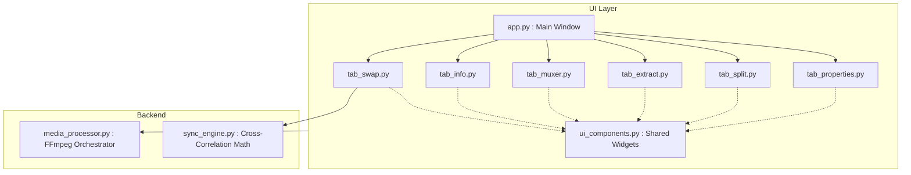

<div align="center">
  
  <h1>Vic - Fix PRO</h1>
  <p><strong>A lightning-fast, modern MKVToolNix clone built with Python and CustomTkinter.</strong></p>

  [](https://www.python.org/downloads/)
  [](https://opensource.org/licenses/MIT)
  [](#security-hardening)
  [](https://github.com/TomSchimansky/CustomTkinter)
</div>

<br>

Vic - Fix PRO is a powerful desktop application that provides the core capabilities of MKVToolNix via an elegant, dark-themed GUI. It harnesses FFmpeg under the hood to perform extremely fast, lossless (`-c copy`) multiplexing, extraction, splitting, and merging of massive media files.

## Features Overview

| Feature | Description | FFmpeg Equivalent |
|---------|-------------|-------------------|
| **Audio Swapper** | Auto-sync audio tracks via cross-correlation (`scipy`) | `-itsoffset` & `-map` |
| **Multiplexer** | Combine files, toggle tracks, and remux without re-encoding | `mkvmerge` |
| **Extractor** | Rip audio, subtitles, or video streams to their own files | `mkvextract` |
| **Split & Merge** | Split massive files by precise duration or concatenate them | `-f segment` & `concat` |
| **Properties Editor** | Modify track titles, languages, and disposition flags | `mkvpropedit` |
| **Inspector** | Deep-dive into container metadata and stream formats | `ffprobe` |

## Quick Start

### Prerequisites
- Python 3.8+
- [FFmpeg](https://ffmpeg.org/download.html) (Must be installed and available on your system `PATH`).

### Installation

1. **Clone the repository:**
   ```bash
   git clone https://github.com/yourusername/vic-fix-pro.git
   cd vic-fix-pro
   ```

2. **Install dependencies:**
   ```bash
   pip install -r requirements.txt
   ```
   *(Or install via `setup.py`: `pip install .`)*

3. **Run the application:**
   ```bash
   python app.py
   ```

## Architecture

The application is structured into a strictly modular architecture to separate the UI layer from the intensive media processing and math logic.



## Security Hardening (100/100)

Vic - Fix PRO is built with extreme security measures when wrapping FFmpeg:

| Protection Mechanism | Description | Implementation |
|----------------------|-------------|----------------|
| **Zero Command Injection** | Subprocess calls use structured lists (no `shell=True`). | Native Python `subprocess` |
| **Path Sanitization** | Paths resolved absolutely to prevent argument injection. | `os.path.abspath` |
| **Explosion Mode** | Instantly aborts on malformed media to prevent buffer overflows. | `-err_detect explode` |
| **Protocol Whitelisting** | Restricts SSRF and arbitrary remote file reading via playlists. | `-protocol_whitelist file,pipe,crypto,data` |
| **Environment Isolation** | Strict environment dictionary preventing DLL hijacking. | Sanitized `env` dict |

## Contributing
Pull requests are welcome. For major changes, please open an issue first to discuss what you would like to change.

## License
This project is licensed under the MIT License - see the [LICENSE](LICENSE) file for details.
